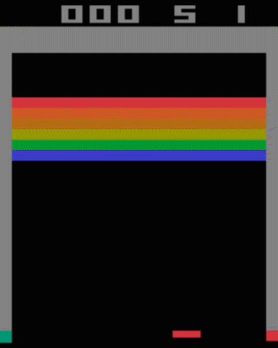

# DQN-Beat-Atari
Keras/TensorFlow implementation of an agent to beat Atari based on deep Q-Network.  
This implementation has referred to the [code by devsisters](https://github.com/devsisters/DQN-tensorflow.git).
However, the tricks to make the model converge are too complicated and the agent can rarely achieve more than 100 points. You have to carefully adjust the hyper-parameters. 
To solve this problem, I apply **layer normalization** to each layer and finally the agent gets a much better performance.

## Environment
- Python 3.6
- TensorFlow  
- Keras  
- Opencv  
- Gym

Install prerequisites with:

    $ pip install gym[atari]
    $ pip install plaidml-keras
    $ pip install opencv-python
    $ pip install tensorflow

Setup PlaidML with:

    $ plaidml-setup
    

## Demo

Result of training by duel network for about 24 hours in 9500 games using GTX 1080 ti.

## References

- [DQN by devsisters](https://github.com/devsisters/DQN-tensorflow.git)

